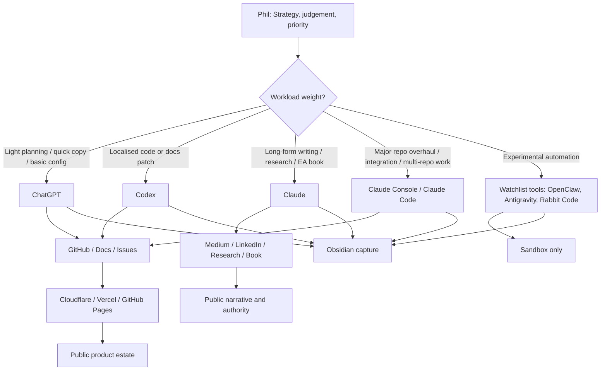
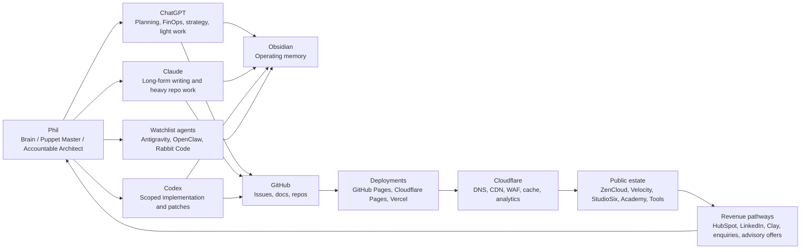

# ZenCloud AI Delivery FinOps Operating Model

## Purpose

This document defines the current ZenCloud operating model for maximising product development, writing output, deployment throughput, and ecosystem governance under a constrained startup budget.

The working constraint is clear: operate like a founder-led startup with less than AUD $1,000 available for the project, while maintaining daily delivery across roughly 30 interconnected repositories, multiple public sites, commercial campaigns, publications, and AI-assisted product builds.

This is a FinOps and RevDev model for a solo founder using AI, GitHub, Cloudflare, Vercel, HubSpot, Obsidian, and selective paid subscriptions to produce maximum useful output for minimum cash burn.

## Core Thesis

Phil is the brain and accountable decision-maker.

AI tools are not the strategy. They are specialised execution shells. Each tool has a role based on workload weight, cost, token efficiency, writing quality, repository depth, and risk.

The operating model is:

```text
Human strategy and judgement first.
AI shells second.
Repositories, deployments, and published artefacts third.
Obsidian captures continuity.
```

The goal is not to automate everything. The goal is to maintain command and control across many workstreams without losing context, burning unnecessary tokens, or creating unmanaged technical debt.

## Current Tool Role Split

| Workload type | Primary tool | Reason |
|---|---|---|
| Planning, architecture thinking, product strategy, lightweight repo direction | ChatGPT | Lowest effective planning cost, strong synthesis, good for product operating logic and FinOps control. |
| Preface work, basic scaffolding, generic configuration, quick prompts, small repo tasks | ChatGPT / Codex | Efficient for low-to-medium complexity execution without burning premium deep-work tokens. |
| Light to medium implementation and patching | Codex | Useful for tactical code changes, repo inspection, localised refactors, documentation updates, and PR-style execution. |
| Heavy multi-repo work, major overhauls, deep integration, complex coding | Claude Console / Claude Code | Reserved for high-value deep work where long-context writing, reasoning, and repo execution quality matter. |
| Long-form articles, EA book material, research papers, LinkedIn series | Claude | Preferred long-form writing shell for polished articles and heavy editorial work. |
| Coffee & Curiosity, AI Architect series, lighter personal thought pieces | ChatGPT | Good enough writing quality at lower operating cost; preserves Claude capacity for heavier work. |
| Emerging AI IDE experimentation | Antigravity / Gemini / OpenClaw / Rabbit Code | Watchlist only until tool value, cost, and control are proven. |
| Source control and deployment memory | GitHub | Source of truth for code, docs, issues, releases, and site deployment state. |
| Permanent operating memory | Obsidian | Control plane for decisions, registers, runbooks, prompts, campaign records, and continuity across chat windows. |

## Light / Medium / Heavy Workload Routing



## FinOps Rules

1. Use ChatGPT first for strategy, framing, planning, operating models, and low-cost synthesis.
2. Use Codex for scoped code/documentation changes where the blast radius is clear.
3. Reserve Claude for long-form writing quality and high-complexity repo work.
4. Do not use heavy coding agents for problems that can be solved by a short prompt, manual check, or GitHub issue.
5. Do not allow autonomous tools to run broadly across production repos without clear scope and human review.
6. Use Obsidian to prevent repeated token spend on the same context.
7. Use GitHub issues to turn volatile chat decisions into durable work items.
8. Avoid adding subscriptions until an existing tool cannot perform the job at acceptable quality.
9. Keep Cloudflare, GitHub Pages, Cloudflare Pages, and Vercel on low-cost/free tiers unless traffic, security, or product requirements justify upgrade.
10. Spend money only where it increases throughput, quality, revenue probability, or risk control.

## Budget Posture

Current strategic budget posture:

```text
Available capital: < AUD $1,000
Primary paid AI subscriptions: ChatGPT + Claude
Preferred infrastructure: free or low-cost tiers
Operating mode: founder-led, manual control, AI-assisted acceleration
Investment priority: revenue-generating advisory surface before tooling expansion
```

The cash discipline is to pay for capability that directly increases daily useful output. Tool experimentation is acceptable only where it does not introduce subscription sprawl or uncontrolled token burn.

## RevDev Link

This operating model is not just cost control. It is revenue development.

The same workflow that builds repos also creates public authority, commercial landing pages, client briefing packs, LinkedIn campaign copy, articles, research papers, product roadmaps, artefact generators, and governance collateral.

Every AI session should ideally produce one of the following:

- a public asset
- a repo improvement
- a deployable product increment
- a commercial lead path
- a reusable operating note
- a governance artefact
- a publishable article
- a better decision record

## Obsidian Capture Model

Obsidian is critical because work is distributed across multiple chat windows, tools, terminals, consoles, and repositories.

Each significant session should end with a lightweight capture:

```text
What changed?
Why did it change?
Which repo/domain/product was affected?
What tool was used?
What still needs action?
Where is the source of truth?
```

This prevents the estate from depending on chat memory. If any chat window dies, the operating memory survives.

## Ecosystem Workflow



## Daily Operating Rhythm

Start in ChatGPT for planning, prioritisation, and workload routing.

Move scoped repo fixes into Codex where the change is bounded and token-efficient.

Move long-form writing, book chapters, research papers, and major article production into Claude.

Move deep multi-repo engineering, integration, and overhaul work into Claude Console / Claude Code.

Capture the decision trail in Obsidian.

Commit durable work into GitHub.

Deploy through GitHub Pages, Cloudflare Pages, or Vercel.

Observe through Cloudflare, HubSpot, LinkedIn, and GitHub.

## Product Implication

This workflow itself may become a product: a low-cost founder operating system for AI-assisted product delivery.

The product concept is not generic automation. It is controlled orchestration: human-led, AI-assisted, FinOps-aware, repository-grounded, and memory-preserving.

Candidate product names:

- **Magister Pupparum** — Latin-style phrase for master of puppets / master of the dolls. Strong metaphor, but may feel theatrical.
- **Magister Automatorum** — master of automations / automata. Better fit for agent orchestration.
- **Orchestrum** — orchestration system. Cleaner product feel.
- **ZenCloud Command Loom** — clearer English, stronger operating metaphor.
- **PuppaOS** — memorable but less executive.

Preferred working name for now:

```text
Magister Automatorum
```

Reason: it captures the idea of a human operator commanding multiple AI agents and automation shells without becoming too tied to the puppet metaphor.

## Next Actions

1. Convert this operating model into a one-page founder FinOps diagram.
2. Create a product concept note for Magister Automatorum.
3. Add a tool scoring matrix covering ChatGPT, Claude, Codex, Cursor, JetBrains, Linear, OpenClaw, Rabbit Code, Antigravity, and GitHub Copilot.
4. Create a daily capture template in Obsidian.
5. Add cost tracking for monthly subscriptions and tool usage.
6. Define the trigger point for adding paid Co-Work / automation tooling.
